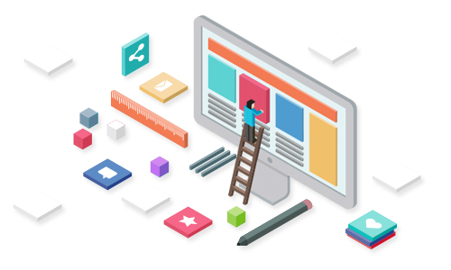
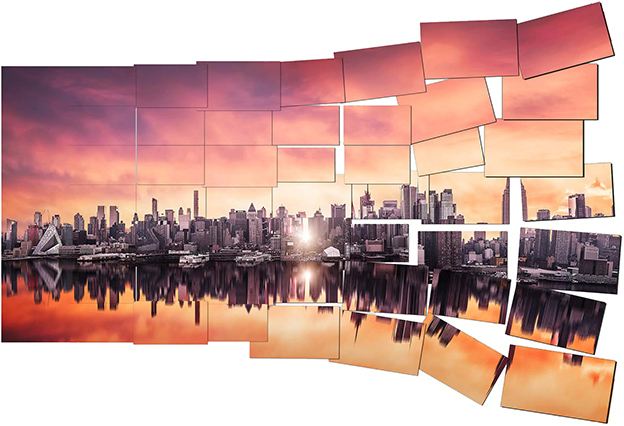
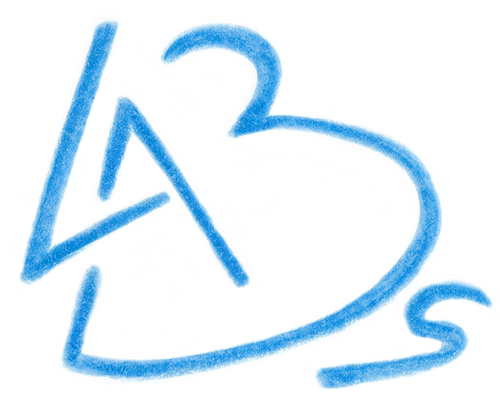

## WEB - Il volto della rete
## Laboratorio di Informatica
___

### menu:
* WWW
* T.I.
* Networking
* IoT
* Big Data
* Net Devices
* MaDe
* Programmazione

___
#### Cos’è il web design?

Progettare siti web che siano dinamici, professionali, creativi, efficienti, usabili e accessibili

Il design di un sito richiede competenze e conoscenze trasversali che vanno dalla grafica alla programmazione. La progettazione di un sito coinvolge figure professionali diverse: graphic designer, esperti di database, di economia, di comunicazione.

___
### Chi è il web designer?

Il web designer è in grado di esprimersi artisticamente e creativamente, ma è anche un
tecnico orientato alla comunicazione, all’intrattenimento, alla cultura, all’economia.
___
### Cos’è il web programming?

Realizzare applicazioni, sia server che client, per offrire servizi e prodotti di alta
qualità, con i linguaggi di programmazione e le piattaforme web di sviluppo più avanzate. Occorre avere
familiarità con linguaggi come CSS, JavaScript, HTML, SQL. Inoltre è richiesta una buona
conoscenza
delle caratteristiche principali dei sistemi di gestione di dati e delle reti di calcolatori.
___
### Chi è il web programmer?

Il web programmer è uno sviluppatore "a tutto tondo" - full stack developer - in grado di gestire aspetti diversi:

analisi dei requisiti, progettazione delle funzionalità, sviluppo e pubblicazione.
Ha dimestichezza con i linguaggi e le piattaforme di sviluppo web più diffuse e sa lavorare in team, anche con esperti di altri ambiti.

___
#### Fotografia immersiva

La tecnica fotografica utilizzata, nota come [Photo
Stitching](https://www.nikonschool.it/experience/photo-stitching.php), permette di fondere molteplici scatti sequenziali in un'unica immagine,
proiettandola all'interno di una sfera virtuale.
In questo modo si ha l'impressione di essere immersi nella scena con la possibilità di guardarsi
attorno

In particolare per questo tipo di immagini sferiche sono state necessarie 60 fotografie per ogni
laboratorio e vista la complessità degli ambienti, un importante lavoro di post-produzione.  
Il progetto è stato ideato dalla commissione orientamento dell'istituto Marconi ed è stato
realizzato dal prof. Federico Bertolli insegnante di Sistemi e reti e Tecnologie di progettazione
di sistemi informatici e di telecomunicazioni

Le schede di approfondimento sono state curate dai Dipartimenti di Fisica - Chimica, Automazione,
Meccanica e Informatica.
____
### Footer

Marconi Labs è un progetto di orientamento scolastico dell'Istituto Tecnico Tecnologico G. Marconi di Rovereto

L'obiettivo consiste nel mostrare al visitatore le molteplici attività laboratoriali sviluppate durante il percorso scolastico del biennio - Chimica e Fisica - e del triennio - Meccanica, Automazione e Informatica.

Particolare enfasi viene data alle attività proposte negli ambienti dei corsi di specializzazione del triennio, fra i quali si contano due laboratori di Meccanica (Lavorazioni meccaniche, Tecnologie meccaniche), un laboratorio di Energia, un laboratorio di Automazione e sei laboratori di Informatica
